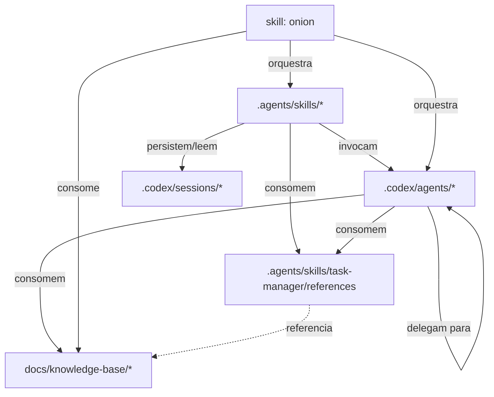

# Meta-spec — Arquitetura do Sistema Onion

## Propósito

Define a estrutura de diretórios obrigatória, o princípio de **framework instalável** e as dependências permitidas entre categorias. Esta spec normatiza o que constitui o "esqueleto" do Sistema Onion como artefato reutilizável em projetos-alvo.

Aplica-se ao **Sistema Onion**, não ao projeto-alvo onde o Onion é instalado.

Referências relacionadas:

- [agents.md](./agents.md), [commands.md](./commands.md)
- [code-standards.md](./code-standards.md), [integrations.md](./integrations.md)

---

## 1. Estrutura de diretórios obrigatória

### 1.1 Root do framework

```
.codex/                     # Operacional — configuração, subagentes, regras e estado do Codex
.agents/                    # Skills invocáveis (cross-client, padrão Agent Skills)
docs/                       # Documentação consumida por humanos e IA
README.md                   # Identidade e ponto de entrada
AGENTS.md                   # Regras de operação para o Codex
CONTRIBUTING.md             # Guidelines para evolução
.env, .env.example          # Configuração de providers e integrações
```

### 1.2 Estrutura de `.codex/`

```
.codex/
├── config.toml             # Configuração central do Codex (modelos, MCP servers, defaults)
├── rules/                  # Regras de permissão (Starlark)
│   └── default.rules       # Política de permissões padrão (era allow/deny do settings.json)
├── hooks.json              # Automação a nível de evento (hooks)
│
├── agents/                 # Subagentes especializados (arquivos flat, TOML)
│   ├── react-developer.toml      # development — especialistas técnicos
│   ├── nodejs-specialist.toml
│   ├── product-agent.toml        # product — discovery e spec
│   ├── task-specialist.toml
│   ├── iso-27001-specialist.toml # compliance — frameworks regulatórios
│   ├── metaspec-gate-keeper.toml # meta — orquestração e criação
│   ├── code-reviewer.toml        # review/git — code review
│   ├── test-engineer.toml        # testing
│   └── docker-specialist.toml    # deployment
│   # 9 agrupamentos de domínio permanecem conceituais; os arquivos são flat
│
├── sessions/               # Estado persistente de workflows faseados
│   └── <feature>/          # Por feature em desenvolvimento
│
├── utils/                  # Utilitários operacionais do Codex (opcional)
├── rules/                  # (ver acima)
└── validation/             # Scripts de validação (opcional)
```

### 1.3 Estrutura de `.agents/`

```
.agents/
└── skills/                 # Skills invocáveis — uma pasta por skill
    ├── onion/
    │   └── SKILL.md        # Orquestrador master / ponto de entrada
    ├── product-collect/
    │   └── SKILL.md        # Workflow faseado de descoberta e spec
    ├── engineer-plan/
    │   └── SKILL.md        # Workflow faseado de implementação
    ├── git-fast-commit/
    │   └── SKILL.md        # GitFlow (feature/release/hotfix via slugs)
    ├── meta-create-agent/
    │   └── SKILL.md        # Criação de artefatos do Onion
    ├── docs-build-tech-docs/
    │   └── SKILL.md        # Geração e validação de documentação
    └── task-manager/
        ├── SKILL.md        # Task Manager Abstraction (skill)
        └── references/     # factory, interface, types, detector, adapters/
```

### 1.4 Estrutura de `docs/`

```
docs/
├── INDEX.md                # Hub de navegação
│
├── meta-specs/             # L0 — constituição do framework (esta spec é uma delas)
│   ├── index.md
│   ├── agents.md
│   ├── commands.md
│   ├── architecture.md
│   ├── code-standards.md
│   └── integrations.md
│
├── analysis/               # Análises críticas datadas (snapshots)
├── plans/                  # Planos de execução
│
├── onion/                  # Documentação operacional (guias, referências, releases)
│   └── shared/             # Templates e prompts compartilhados (era .claude/commands/common/)
│
├── knowledge-base/         # KBs estruturadas para consumo por IA
│   ├── concepts/
│   ├── frameworks/
│   ├── tools/
│   ├── platforms/
│   └── providers/
│
├── sdaal/                  # KB ativa sobre o padrão SDAAL
│
├── business-context/       # Template vazio — populado no projeto-alvo
├── technical-context/      # Template vazio — populado no projeto-alvo
└── compliance-context/     # Template vazio — populado no projeto-alvo (quando aplicável)
```

---

## 2. Separação operacional (`.codex/` + `.agents/`) vs `docs/`

| Aspecto | `.codex/` + `.agents/` | `docs/` |
|---|---|---|
| Natureza | Operacional | Documentação |
| Consumido por | Codex (em runtime) | Humanos + IA (em leitura) |
| Formato | TOML/Markdown estruturado para execução | Markdown para consumo informacional |
| Versionamento | Junto com PRs que alteram comportamento | Junto com PRs que mudam doutrina ou descobertas |
| Acesso pelo usuário final | Indireto via invocação (`$<skill>`, `@<subagente>`) | Direto via leitura de arquivos |

**Regra**: artefato invocável vive em `.codex/` (config, subagentes, regras, hooks, sessões) ou `.agents/` (skills); descrição/explicação/análise vive em `docs/`.

---

## 3. Princípio de framework instalável

O Sistema Onion deve ser **instalável em qualquer projeto** (novo, legado ou regulado) **copiando ou clonando `.codex/`, `.agents/` e `docs/`** (mais `AGENTS.md` no root) sem necessidade de adaptação de paths absolutos.

### 3.1 Premissas que o framework PODE assumir sobre o projeto-alvo

- Tem `.codex/` no root do projeto (estrutura padrão do Codex)
- Tem `.agents/` no root para skills (padrão Agent Skills)
- Tem um arquivo `AGENTS.md` no root que pode ser sobrescrito ou estendido
- Pode ter `.env` no root (criado a partir de `.env.example` via `$meta-setup-integration`)
- Pode (mas não precisa) ter `docs/` para os contextos spec-as-code

### 3.2 Premissas que o framework NÃO PODE assumir

- Path absoluto específico (ex: `/home/<user>/`)
- Existência de monorepo, NX, ou estrutura específica
- Linguagem de programação específica (Node, Python, Go)
- Provider de Task Manager pré-configurado
- Existência de `git` inicializado

### 3.3 Implicações

- Skills e subagentes devem usar **paths relativos** ou variáveis de ambiente
- Configuração específica do projeto-alvo vai em `.env` (não em skills/subagentes)
- Detecção de stack/linguagem deve ser dinâmica (`$docs-reverse-consolidate`)

---

## 4. Dependências permitidas entre categorias

### 4.1 Diagrama de dependências



### 4.2 Regras de dependência

| De → Para | Permitido | Notas |
|---|---|---|
| `skills/*` → `.codex/agents/*` | Sim | Padrão de delegação |
| `skills/*` → skill orquestradora (`onion`) | Sim | Quando precisa de orquestração |
| `skills/*` → `task-manager/references` | Sim | Abstrações reutilizáveis (Task Manager) |
| `skills/*` → `.codex/sessions/*` | Sim | Workflows faseados persistem estado |
| `.codex/agents/*` → `.codex/agents/*` | Sim | Delegação entre especialistas |
| `.codex/agents/*` → `docs/knowledge-base/*` | Sim | KBs como referência |
| `.codex/agents/*` → `task-manager/references` | Sim | Especialmente Task Manager |
| `.codex/agents/*` → `skills/*` | **Não** | Subagente não invoca skill diretamente — sugere ao usuário |
| skill orquestradora → `skills/*`, `.codex/agents/*`, `docs/*` | Sim | Orquestradores |
| `task-manager/references` → `.codex/agents/*`, `skills/*` | **Não** | Abstrações devem ser puras |
| compliance → engineer (direto) | **Não** | Coordenação via meta ou `$docs-build-compliance-docs` |

### 4.3 Acoplamento entre dimensões

As três dimensões peer (produto, engenharia, compliance) **não devem ter dependências cruzadas diretas** em nível de skill. Coordenação acontece via:

- **Sessions** (estado compartilhado)
- **Meta-skills** (`$meta-*`)
- **Skill orquestradora** (`$onion`)
- **Documentação consolidada** em `docs/`

---

## 5. Plataforma alvo

**Sistema Onion roda exclusivamente em OpenAI Codex.**

Implicações:

- Não há suporte planejado para Cursor, Continue, Cline ou outras CLIs
- Não há CLI standalone (`onion init/add/migrate` foram abandonados em 2026-05-18)
- Não há produto npm distribuído
- Mudanças na plataforma Codex (estrutura de `.codex/`/`.agents/`, formato de skills/subagentes, `config.toml`, novas tools) podem exigir atualização do framework

---

## 6. Estrutura de release e versionamento

### 6.1 Versionamento

- Versão do framework: implícita no estado do branch `main` (não há semver formal)
- Versão de meta-specs: campo `version` no frontmatter, semver simples (`1.0.0`)
- Releases significativas: registradas em `docs/onion/RELEASE-NOTES-*.md` quando aplicável

### 6.2 Sessões e estado

- `.codex/sessions/<feature>/` é estado runtime, não versionado por padrão
- `.gitignore` deve excluir `.codex/sessions/` em projetos-alvo se o estado for individual
- No repo do Onion (este repositório), `.codex/sessions/` pode ser preservado para teste/exemplo

---

## 7. Proibições explícitas

- **Proibido** criar diretório de primeiro nível fora dos listados em Seções 1.2, 1.3 e 1.4 sem PR específico para esta meta-spec
- **Proibido** introduzir `.onion/` ou estrutura agnóstica alternativa (abandonado em 2026-05-18)
- **Proibido** criar `packages/` ou diretório de pacote distribuível (abandonado em 2026-05-18)
- **Proibido** skill ou subagente invocar artefato fora da relação permitida (ver Seção 4.2)
- **Proibido** depender de path absoluto

---

## 8. Versionamento e mudanças

Mudanças nesta spec exigem:

1. PR específico para `docs/meta-specs/architecture.md`
2. Atualização do campo `version`
3. Avaliação de impacto em skills/subagentes existentes
4. Aprovação por `@metaspec-gate-keeper`
